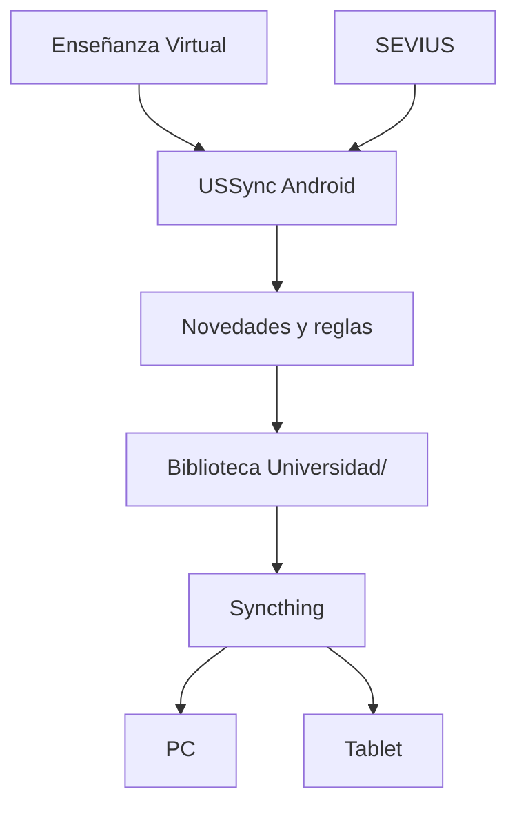

# USSync

USSync mantiene tu biblioteca universitaria desde Android. El teléfono consulta Enseñanza Virtual y SEVIUS, detecta novedades, aplica tus decisiones y descarga los documentos a una carpeta elegida por ti. Syncthing replica esa carpeta en el PC y la tablet. El PC no necesita estar encendido para iniciar sesión, escanear, decidir, descargar o recibir avisos.

El desarrollo Android se ha iniciado en la Fase 1. La aplicación Python existente permanece como implementación de referencia (`legacy/reference` conceptual): no es el dispositivo principal ni recibirá nuevas funciones de producto.

## Qué sincroniza Syncthing

Comparte solamente la carpeta de biblioteca seleccionada, por ejemplo `/storage/emulated/0/Universidad`. Configura Syncthing Android para observar esa carpeta y añade PC/tablet como dispositivos remotos. USSync no usa la API de Syncthing ni necesita conocer su configuración.

No compartas la base de datos de USSync, cookies, tokens, sesiones, credenciales, bloqueos ni temporales. Todos viven en el almacenamiento privado Android. El backup de USSync tampoco lleva esos datos sensibles.

## Funcionamiento previsto

Durante el onboarding eliges la biblioteca mediante el selector de árbol de Android (Storage Access Framework). USSync conserva el permiso persistente para esa carpeta. Después abres el login oficial de la Universidad de Sevilla dentro de un WebView: SSO y MFA se completan ahí; USSync nunca pide ni guarda tu contraseña. La sesión se comprueba con la API de perfil de Blackboard y se usa localmente para las consultas REST.

Cada escaneo consulta solo metadatos. Compara el catálogo previo y clasifica cada documento como NEW, UPDATED, UNCHANGED o REMOVED. Que desaparezca de la fuente no borra su copia local. NEW y UPDATED llegan a **Novedades** una sola vez por revisión, donde puedes descargar, ignorar o dejar para más tarde.

Las reglas tienen prioridad y pueden filtrar por asignatura, carpeta, fuente, extensión, texto, tamaño y tipo de novedad. Su acción es AUTO_DOWNLOAD, ASK, IGNORE o NOTIFY_ONLY; la opción inicial es ASK. También se crean desde una novedad con «Recordar esta decisión» para esa carpeta, asignatura, extensión o archivos similares.

Las descargas se hacen por streaming, se validan, calculan SHA-256 y se publican solo al estar completas. Si Syncthing trae un PDF anotado desde otro dispositivo, su hash ya no coincide con el que guardó USSync. Ante una actualización del profesor, la decisión inicial conserva ese PDF y descarga la nueva versión aparte en `Versiones/`; nunca se sobrescriben silenciosamente apuntes del usuario.

WorkManager permite escanear con la frecuencia y condiciones elegidas. Android puede aplazar esos trabajos para ahorrar batería, por lo que 15 minutos es una preferencia, no una promesa de ejecución exacta. Las notificaciones agrupan las novedades y abren directamente esa pantalla.

## Estado del repositorio

| Área | Estado |
| --- | --- |
| Arquitectura, directorios Android y build base | Fase 1 completada |
| Login WebView y prueba `/users/me` | Fase 2 pendiente |
| EV, Room, novedades, descargas, reglas y workers | Fases posteriores |
| SEVIUS, SAF, backup y pulido | Fases posteriores |

El diseño, esquema Room, autenticación, riesgos y mapa de migración están en [docs/ANDROID_ARCHITECTURE.md](docs/ANDROID_ARCHITECTURE.md).

## Proyecto Android

El módulo nativo está en `app/`, con Kotlin, Jetpack Compose, Room, OkHttp, WorkManager, WebView y SAF previstos como dependencias. Se requiere Android Studio con JDK 17 y un SDK Android 35 para compilarlo.

USSync es un proyecto independiente, sin afiliación oficial a la Universidad de Sevilla. No incluyas sesiones, credenciales, configuraciones personales ni material docente real en el repositorio.
