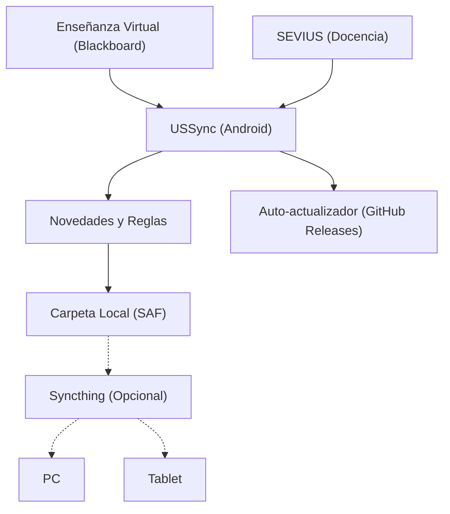

# USSync

[](https://github.com/JoseGarciaMayen/ussync/actions/workflows/checks.yml)
[](https://github.com/JoseGarciaMayen/ussync/releases/latest)

USSync es una aplicación nativa para Android diseñada para sincronizar de forma autónoma los materiales universitarios de la Universidad de Sevilla (Enseñanza Virtual / Blackboard Learn y SEVIUS).

El teléfono consulta los portales de la universidad en segundo plano, detecta novedades o actualizaciones de apuntes, aplica tus reglas de descarga y guarda los documentos organizados en la carpeta que elijas (por ejemplo, para replicarla en tu PC o tablet con Syncthing).

*Read this in English: [English README](README_EN.md)*



---

## Características principales

- **Autenticación segura:** Inicio de sesión mediante WebView oficial de la US (SSO y MFA). USSync nunca solicita ni almacena tus credenciales o contraseña; la sesión se gestiona con cookies locales protegidas en el dispositivo.
- **Soporte de publicación condicional:** Detección de reglas de publicación adaptativa (*Adaptive Release*) en Blackboard. Si un archivo aún no está abierto (por ejemplo, zips de problemas con fecha futura), la app muestra la fecha y hora exacta en la que estará disponible sin dar errores 404.
- **Gestión inteligente de novedades:** Detección de archivos nuevos, modificados y eliminados. Los archivos desaparecidos de la plataforma docente nunca se borran de tu almacenamiento local.
- **Reglas personalizables y filtros:**
  - Descarga automática, preguntar o ignorar por asignatura, carpeta, extensión o tamaño máximo en MB.
  - Bloqueo de extensiones específicas (vídeos pesados, audios, etc.) para ahorrar espacio y datos móviles.
- **Protección de apuntes anotados:** Si editas o anotas un PDF localmente, su hash cambia; si el profesor publica una versión nueva del documento, USSync no sobrescribe tus notas, sino que descarga la revisión conservando tus archivos.
- **Sincronización en segundo plano:** Integración con Android WorkManager con opciones de frecuencia, ahorro de batería, restricción de solo Wi-Fi y pausa en horario nocturno.
- **Actualizaciones automáticas:** El instalador integrado comprueba GitHub Releases, descarga las nuevas versiones con barra de progreso y solicita la actualización directamente en tu dispositivo sin necesidad de entrar a navegadores o descargar manualmente.

---

## Descarga e Instalación

1. Descarga la última versión de **[USSync.apk](https://github.com/JoseGarciaMayen/ussync/releases/latest)** desde GitHub Releases.
2. Ábrela en tu teléfono Android y autoriza la instalación desde tu gestor de archivos o navegador.
3. Concede el permiso para buscar e instalar actualizaciones si la app te lo solicita. Las futuras versiones se notificarán y actualizarán directamente desde la propia app.

---

## Replicación con PC o Tablet (Opcional)

Si utilizas Syncthing u otro sistema de sincronización entre dispositivos:
1. En USSync, selecciona la carpeta de tu biblioteca (por ejemplo en tu almacenamiento interno o tarjeta SD) mediante el selector de carpetas de Android (SAF).
2. Configura Syncthing para compartir exclusivamente esa carpeta con tu PC o tablet.
3. No compartas la base de datos interna ni la caché de la aplicación; todos los datos de sesión y configuración permanecen protegidos en el almacenamiento privado de USSync.

---

## Compilación para desarrolladores

El proyecto es una aplicación nativa para Android desarrollada en Kotlin y Jetpack Compose.

### Requisitos:
- Android Studio Ladybug / Koala o superior.
- JDK 17 (`JAVA_HOME`).
- Android SDK 35.

### Comandos útiles:

- **Ejecutar pruebas unitarias:**
  ```bash
  ./gradlew testDebugUnitTest
  ```
- **Compilar APK de depuración:**
  ```bash
  ./gradlew assembleDebug
  ```
- **Compilar APK de lanzamiento (Release):**
  ```bash
  ./gradlew assembleRelease
  ```
- **Instalar en un dispositivo conectado por ADB:**
  ```bash
  ./android-install.sh
  ```

---

## Aviso legal

USSync es un desarrollo libre e independiente, sin vinculación institucional ni respaldo oficial por parte de la Universidad de Sevilla. El código fuente no almacena material docente, credenciales ni información privada.
