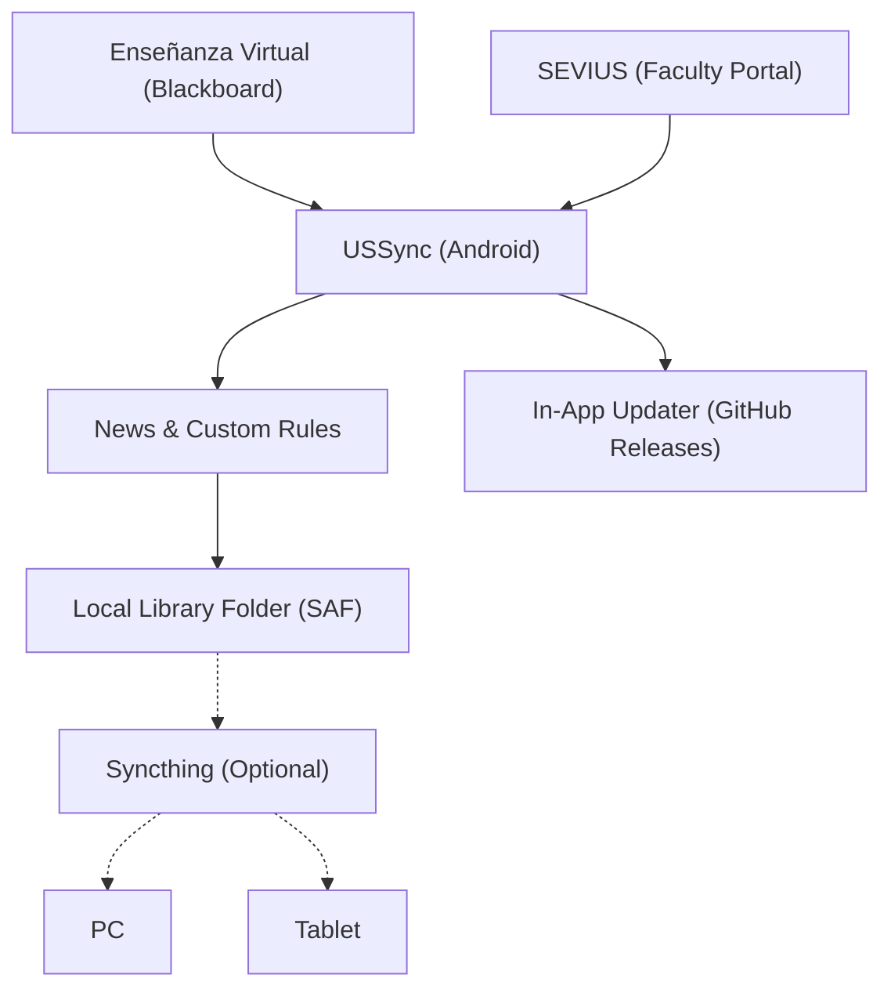

# USSync

[](https://github.com/JoseGarciaMayen/ussync/actions/workflows/checks.yml)
[](https://github.com/JoseGarciaMayen/ussync/releases/latest)

USSync is a native Android application designed to autonomously synchronize course materials from the University of Seville (Enseñanza Virtual / Blackboard Learn and SEVIUS).

Your phone periodically queries university portals in the background, detects new materials or professor updates, applies your custom rules, and keeps all course documents neatly organized in a local folder of your choice (which can easily be replicated across your PC or tablet with tools like Syncthing).

*Leer en español: [README en español](README.md)*



---

## Key Features

- **Secure Authentication:** Standard University of Seville SSO and MFA login completed inside an official WebView. USSync never asks for, handles, or stores your university credentials or password; the session is preserved using local sandboxed cookies on your device.
- **Adaptive Release Support:** Native support for Blackboard Learn Adaptive Release rules. When files have scheduled release constraints (e.g., zip files with future release dates), the app displays the exact availability date and time instead of failing with HTTP 404 errors.
- **Smart Catalog Reconciliation:** Automatically detects new, updated, and removed documents. Files removed from university portals are never deleted from your local device.
- **Customizable Rules & Filters:**
  - Auto-download, ask, or ignore materials based on course, folder path, file extension, or file size limits.
  - Blacklist specific formats (e.g. video recordings or audio files) to save storage and mobile data.
- **Annotated Notes Protection:** If you edit or annotate a PDF locally, its file hash changes; if the professor later uploads a revised version, USSync never overwrites your notes silently, keeping both copies intact.
- **Reliable Background Sync:** Powered by Android WorkManager with configurable polling frequency, battery-saver checks, Wi-Fi-only restrictions, and scheduled quiet hours.
- **Built-in Auto-Updater:** Checks GitHub Releases for new updates, downloads the APK with a live progress bar, and triggers native Android package installation directly without requiring manual browser downloads.

---

## Download & Installation

1. Download the latest **[USSync.apk](https://github.com/JoseGarciaMayen/ussync/releases/latest)** from GitHub Releases.
2. Open the file on your Android device and grant permission to install unknown apps from your browser or file manager if prompted.
3. Allow the app to check for and install updates. Future releases will be notified and updated seamlessly from within the app.

---

## Multi-Device Sync with PC or Tablet (Optional)

If you use Syncthing or any other sync software:
1. In USSync, pick your library destination folder on internal storage or SD card via Android's Storage Access Framework (SAF).
2. Configure Syncthing to share only that selected library folder with your computer or tablet.
3. Never share USSync's private internal application folder, database, or cache; all tokens and session state remain strictly private on Android.

---

## Building from Source

USSync is a modern native Android application built with Kotlin and Jetpack Compose.

### Requirements:
- Android Studio Ladybug / Koala or newer.
- JDK 17 (`JAVA_HOME`).
- Android SDK 35.

### Useful Commands:

- **Run Unit Tests:**
  ```bash
  ./gradlew testDebugUnitTest
  ```
- **Build Debug APK:**
  ```bash
  ./gradlew assembleDebug
  ```
- **Build Release APK:**
  ```bash
  ./gradlew assembleRelease
  ```
- **Install on ADB-connected device:**
  ```bash
  ./android-install.sh
  ```

---

## Disclaimer

USSync is an independent open-source project and is not affiliated with, maintained by, or officially endorsed by the Universidad de Sevilla. The repository does not host private academic contents, student data, or personal credentials.
