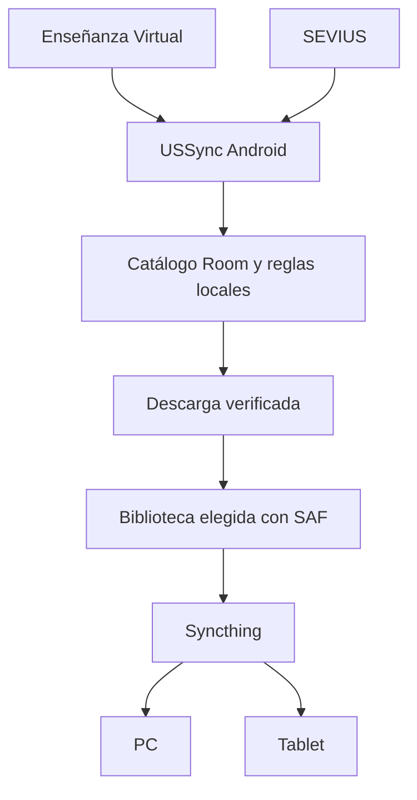

# Arquitectura Android de USSync

## Decisión

Android es el único cerebro de USSync. Descubre materiales de Enseñanza Virtual y SEVIUS, conserva el catálogo y las decisiones, descarga a la biblioteca y notifica novedades. PC y tablet solo replican esa biblioteca con Syncthing y pueden permanecer apagados durante días.

USSync no llama a la API de Syncthing. El usuario selecciona con SAF una carpeta, por ejemplo `/storage/emulated/0/Universidad`; Syncthing observa esa misma carpeta por fuera de USSync. La base Room, cookies WebView, registros, credenciales y temporales viven en almacenamiento privado de la aplicación y jamás se exportan a ella.

## Módulos

El código vive en `app/src/main/java/es/us/ussync/`:

- `ui/`: Compose, navegación y ViewModels.
- `domain/`: casos de uso, reglas, cambios y conflictos.
- `data/`: repositorios, Room, DAOs y mapeadores.
- `network/`: OkHttp, reintentos, límites y validación HTTP.
- `blackboard/`: WebView de login y API REST de EV.
- `sevius/`: catálogo público y relación proyecto→programa.
- `sync/`: coordinación de escaneo y descargas, sin dependencia Syncthing.
- `workers/`: trabajos de WorkManager.
- `storage/`: SAF, hashes, publicación y versionado visible.
- `notifications/`: canal y avisos agrupados.

Las capas dependen hacia dentro: UI y workers invocan casos de uso; los casos de uso usan repositorios y puertos; los adaptadores de red, Room, WebView y SAF no se filtran a la interfaz.

## Room

La primera migración de Room creará estas tablas. Fechas en UTC; tamaños en bytes.

| Entidad | Campos esenciales | Propósito |
| --- | --- | --- |
| `CourseEntity` | `id`, `source`, `remoteId`, `name`, `folder`, `selected`, `lastSeen` | Cursos EV y asociación lógica con SEVIUS. |
| `RemoteDocumentEntity` | `key`, `source`, `courseId`, `courseName`, `relativePath`, `filename`, `revision`, `size`, `firstSeen`, `lastSeen`, `remoteAvailable`, `lastDownloadedHash`, `lastDownloadedRevision` | Estado remoto. `key` EV: `ev:{course}:{content}:{attachment}`. |
| `ScanEntity` | `id`, `startedAt`, `finishedAt`, `source`, `outcome`, `errorSummary` | Auditoría de cada escaneo. |
| `DocumentObservationEntity` | `scanId`, `documentKey`, `classification` | Resultado NEW, UPDATED, UNCHANGED o REMOVED. |
| `InboxItemEntity` | `id`, `documentKey`, `revision`, `kind`, `state`, `ruleAction`, `createdAt`, `resolvedAt` | Una decisión pendiente por documento y revisión. |
| `RuleEntity` | `id`, `priority`, filtros opcionales, `action`, `enabled` | Reglas ordenadas y comprensibles. |
| `DownloadRecordEntity` | `id`, `documentKey`, `remoteRevision`, `targetUri`, `sha256`, `bytes`, `result`, `createdAt` | Qué versión publicó USSync y dónde. |
| `SeviusSelectionEntity` | `subjectCode`, `center`, `year`, `group`, `projectValue`, `programValue`, `courseId` | Elección y relación exacta del programa. |
| `AppSettingsEntity` | clave/valor tipado para `treeUri`, escaneo, red, batería, avisos y política de actualizaciones | Preferencias no sensibles. |

Índices: `RemoteDocument(key)`, `RemoteDocument(lastSeen)`, `Inbox(documentKey, revision)` único, `DownloadRecord(documentKey, createdAt)` y `Rule(priority)`. Un escaneo se procesa en transacción: marca presentes, clasifica contra el estado anterior, crea solo el inbox que no existe para esa revisión y marca como `remoteAvailable=false` los documentos no observados. Un REMOVED nunca elimina un archivo local ni un `DownloadRecord`.

## Login de Enseñanza Virtual

1. La pantalla abre un `WebView` a `https://ev.us.es/ultra`; USSync no dibuja ni solicita usuario, contraseña o MFA.
2. El usuario completa SSO/MFA normal. El `WebViewClient` solo considera el proceso terminado cuando `GET /learn/api/public/v1/users/me` (con alternativa `/learn/api/v1/users/me`) devuelve un perfil con `id`.
3. Se llama a `CookieManager.flush()` y se pide `CookieManager.getCookie()` para cada origen EV que vaya a consultar. Android documenta que devuelve pares `name=value` en formato de cabecera `Cookie` y que `flush` persiste las cookies accesibles. [Referencia oficial](https://developer.android.com/reference/android/webkit/CookieManager).
4. Un interceptor de OkHttp obtiene esas cookies en el momento de la petición y las envía exclusivamente a HTTPS `ev.us.es`. No se serializan en Room, backup ni biblioteca; WebView conserva la sesión dentro del sandbox de la app.
5. Un 401 provoca `SessionExpired`, invalida el estado de sesión visual y deja los inbox intactos. Un 403 es permiso denegado; un 404 puede activar el prefijo alternativo y, si no funciona, se informa de API incompatible.

La hipótesis se valida funcionalmente en la Fase 2 con una cuenta autorizada: login WebView → `/users/me` por OkHttp → `/users/me` por WebView. SSO que use cookies particionadas, certificados de cliente o tokens ligados al contexto puede impedir compartir la sesión. En ese caso el adaptador conservará las lecturas en `WebView` como alternativa, manteniendo el mismo conector y sin scraping visual.

## Escaneo, reglas y descargas

El conector Blackboard conserva el recorrido de la referencia Python: `users/me`, cursos paginados, contenidos, hijos y adjuntos. Solo acepta URLs HTTPS del host `ev.us.es`; conserva nombres, tamaño y `modified`/revisión cuando la API lo exponga. SEVIUS vuelve a leer su publicación en cada escaneo y añade el programa asociado a la versión del proyecto seleccionado, nunca «el más nuevo».

`ChangeDetector` compara la observación con `RemoteDocumentEntity`: ausente antes es NEW; misma identidad con revisión o metadatos materiales distintos es UPDATED; igual es UNCHANGED; antes disponible y ahora ausente es REMOVED. NEW y UPDATED se convierten una vez en `InboxItem`; el estado resuelto evita que resurjan en escaneos posteriores sin una nueva revisión.

`RuleEvaluator` ordena reglas por prioridad descendente y desempate por creación. Coinciden, cuando se indiquen, fuente, curso, prefijo de carpeta, extensión, texto, intervalo de tamaño y clase de novedad. La primera coincide; sin regla es ASK. La acción decide AUTO_DOWNLOAD, ASK, IGNORE o NOTIFY_ONLY. La UI puede crear una regla desde una novedad limitándola a carpeta, asignatura, extensión o nombre similar.

La descarga se hace con WorkManager y OkHttp a un temporal privado. Se transmite por bloques, respeta reintentos y `Retry-After`, rechaza HTML inesperado y exige `%PDF-` para PDF. Tras SHA-256 se publica con SAF. SAF no garantiza un rename atómico entre proveedores: si el proveedor lo permite se usa movimiento dentro del mismo árbol; si no, se escribe un documento temporal dentro del árbol, verifica hash, crea el destino y borra el temporal solo al terminar. Nunca se borra el original antes de que el nuevo esté validado.

Antes de actualizar, el hash del archivo actual se compara con el hash guardado por USSync. Si difiere, es una copia modificada por el usuario o por Syncthing: la acción predeterminada publica la actualización en `Versiones/Nombre [YYYY-MM-DD HHmmss] [id].pdf` y conserva el archivo principal. Sustituir e ignorar son decisiones explícitas de la pantalla de novedades. Si no hay modificación local, la copia anterior también se conserva en `Versiones/` antes de sustituirla. El sufijo corto de identidad evita colisiones en el mismo minuto.

## Plan de entrega y riesgos

| Fase | Entregable y criterio de salida |
| --- | --- |
| 1 | Este documento y el proyecto Compose/Gradle base; Python queda intacto como `legacy/reference`. |
| 2 | WebView y prueba real de `/users/me` desde OkHttp. Sin ese resultado no avanza EV. |
| 3 | Cursos y exploración EV manual, con pruebas MockWebServer. |
| 4 | Room, catálogo, clasificador e inbox NEW/UPDATED/UNCHANGED/REMOVED. |
| 5–8 | Novedades, descarga segura, conflicto/versiones y reglas. |
| 9–12 | WorkManager/avisos, SEVIUS, SAF/Syncthing práctico, backup no sensible y pulido. |

Riesgos principales: compatibilidad real de cookies SSO, cambios no documentados de Blackboard y HTML de SEVIUS, límites de WorkManager (nunca se promete exactitud de 15 minutos), permisos persistentes SAF revocados y falta de rename atómico de algunos proveedores. Cada uno queda aislado tras una prueba de fase, sin iniciar la fase dependiente antes de superarla.

La referencia Python aporta comportamiento, no código Android reutilizable: `ev.py` define el recorrido REST y seguridad de origen; `sevius.py` la asociación correcta; `engine.py` las garantías de descarga y conflicto; `storage.py` el historial, hashes y ejecución; `web.py` y `static/` solo inspiran los flujos de usuario. Playwright, FastAPI, CLI y el frontend web no forman parte del runtime Android.
